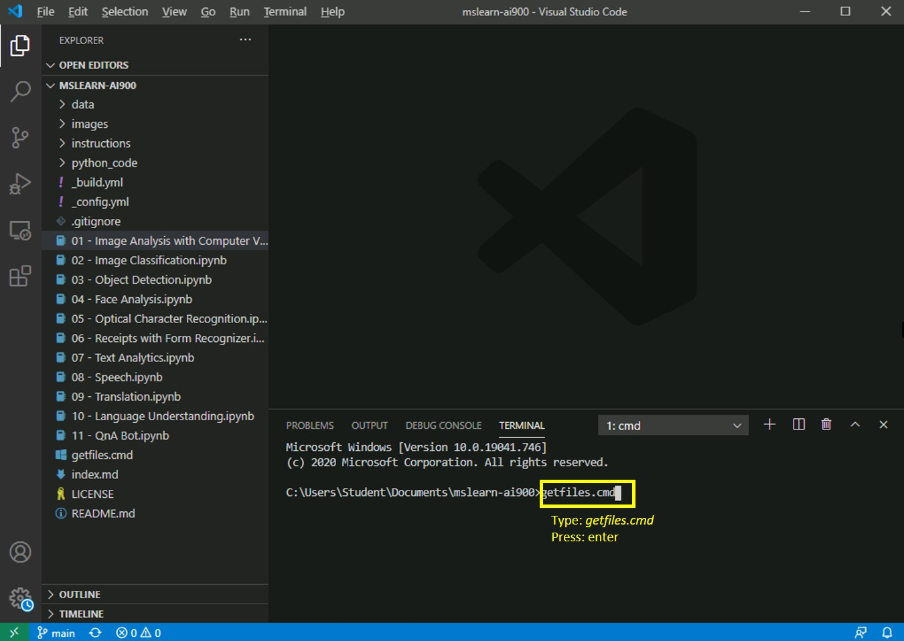

---
lab:
    title: 'Analisis Teks'
---

# Lab AI-900
## Mendapatkan file terbaru

1.  Buka Visual Studio Code (ikon program disematkan ke taskbar bawah). Jika sudah terbuka, Anda akan melihat proyek MSLEARN-AI900 di panel sebelah kiri.

2.  Kami akan mengambil versi terbaru proyek tersebut. Di terminal yang terbuka, ketik +++getfiles.cmd+++ dan tekan **enter**. Perintah ini akan mengambil versi terbaru proyek ke folder Anda. 
3.  Setelah perintah berjalan, Anda dapat menutup panel terminal. Sekarang, Anda dapat memulai lab. 

Di lab ini, kita akan membuat aplikasi yang dapat memahami bahasa.

-  Buka buku catatan **07 - Analisis Teks.ipynb** di Visual Studio Code.
    **Catatan:** Anda mungkin diminta untuk menyelesaikan survei 2 menit. Mulai dan pilih **Tidak, terima kasih**. Anda mungkin perlu melakukan ini lebih dari sekali.
-  Ikuti petunjuk di buku catatan untuk menyelesaikan lab ini.
